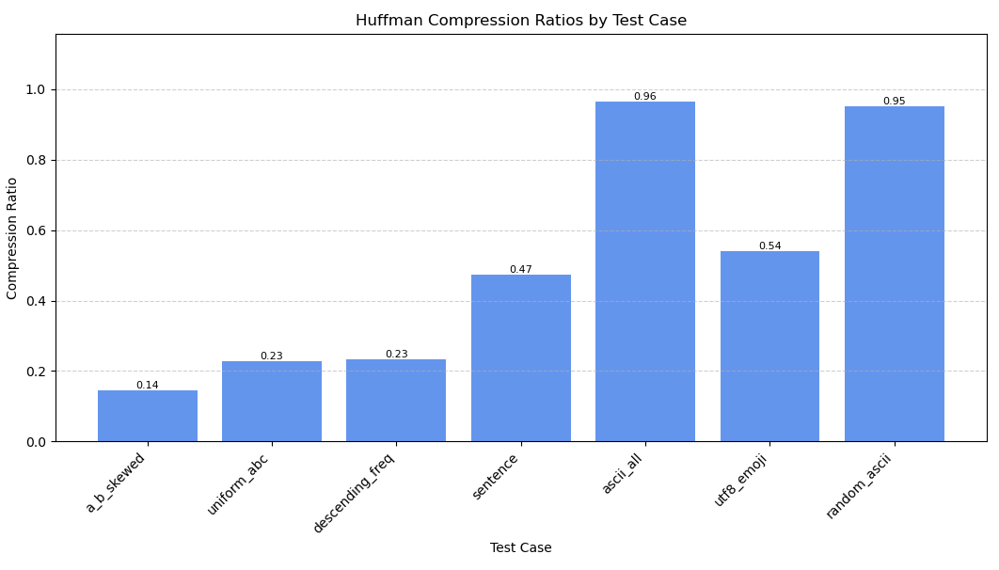

# huff - Simple huffman compressor

Simple C++ implemention of huffman coding and wrapper program for compressing files. Assignment for COMP000327.

## huff usage

```plaintext
huff - Simple huffman compressor
Params:
huff --help     | -h
huff --compress | -c  [source] [target]
huff --extract  | -x  [source] [target]
```

## Class reference

### HuffmanTree

Builds and traverses the Huffman coding tree.

```cpp
class HuffmanTree {
public:
    // Constructors
    HuffmanTree(const std::string& content);  // Build tree from content
    HuffmanTree(const HuffmanFile& file);     // Build tree from encoded file

    // Tree traversal
    void reset();            // Reset traversal state
    bool isLeaf() const;     // Check if current node is a leaf
    char getChar() const;    // Get character at current leaf node
    bool descend(bool direction);  // Move down tree (false=zero, true=one)
    void ascend();           // Move up tree

    // Encoding/decoding
    std::deque<bool> getTreeBits();  // Get tree structure bits
    std::deque<char> getLeaves();    // Get leaf characters
};

```

### HuffmanFile

Handles reading / writing encoded files with metadata.

```cpp
class HuffmanFile {
public:
    // Constructors
    HuffmanFile();  // Create empty file
    HuffmanFile(const std::string& path);  // Read from file
  
    // File operations
    std::size_t size() const;  // Get file size in bytes
    void write(const std::string& path);  // Write to file
};
```

### HuffmanEncoder

Encodes strings into compressed format.

```cpp
class HuffmanEncoder {
public:
    // Constructor
    HuffmanEncoder(const std::string& content);  // Encode content
  
    // Result access
    HuffmanFile result() const;  // Get encoded file
};
```

### HuffmanDecoder

Decodes compressed files back to original strings.

```cpp
class HuffmanDecoder {
public:
    // Constructor
    HuffmanDecoder(const HuffmanFile& file);  // Decode file
  
    // Result access
    std::string result() const;  // Get decoded content
};
```

## Compression ratio



## Citations

A few unit test cases taken from [Stanford CS106B winter 2022 Assignment 9](). See source for details.

## License

### The MIT License (MIT)

Copyright © 2025 <copyright holders>

Permission is hereby granted, free of charge, to any person obtaining a copy of this software and associated documentation files (the “Software”), to deal in the Software without restriction, including without limitation the rights to use, copy, modify, merge, publish, distribute, sublicense, and/or sell copies of the Software, and to permit persons to whom the Software is furnished to do so, subject to the following conditions:

The above copyright notice and this permission notice shall be included in all copies or substantial portions of the Software.

THE SOFTWARE IS PROVIDED “AS IS”, WITHOUT WARRANTY OF ANY KIND, EXPRESS OR IMPLIED, INCLUDING BUT NOT LIMITED TO THE WARRANTIES OF MERCHANTABILITY, FITNESS FOR A PARTICULAR PURPOSE AND NONINFRINGEMENT. IN NO EVENT SHALL THE AUTHORS OR COPYRIGHT HOLDERS BE LIABLE FOR ANY CLAIM, DAMAGES OR OTHER LIABILITY, WHETHER IN AN ACTION OF CONTRACT, TORT OR OTHERWISE, ARISING FROM, OUT OF OR IN CONNECTION WITH THE SOFTWARE OR THE USE OR OTHER DEALINGS IN THE SOFTWARE.
